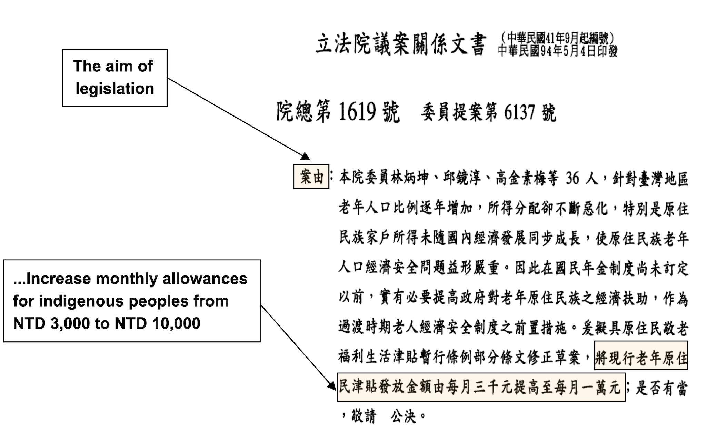
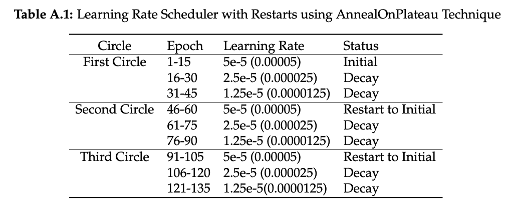
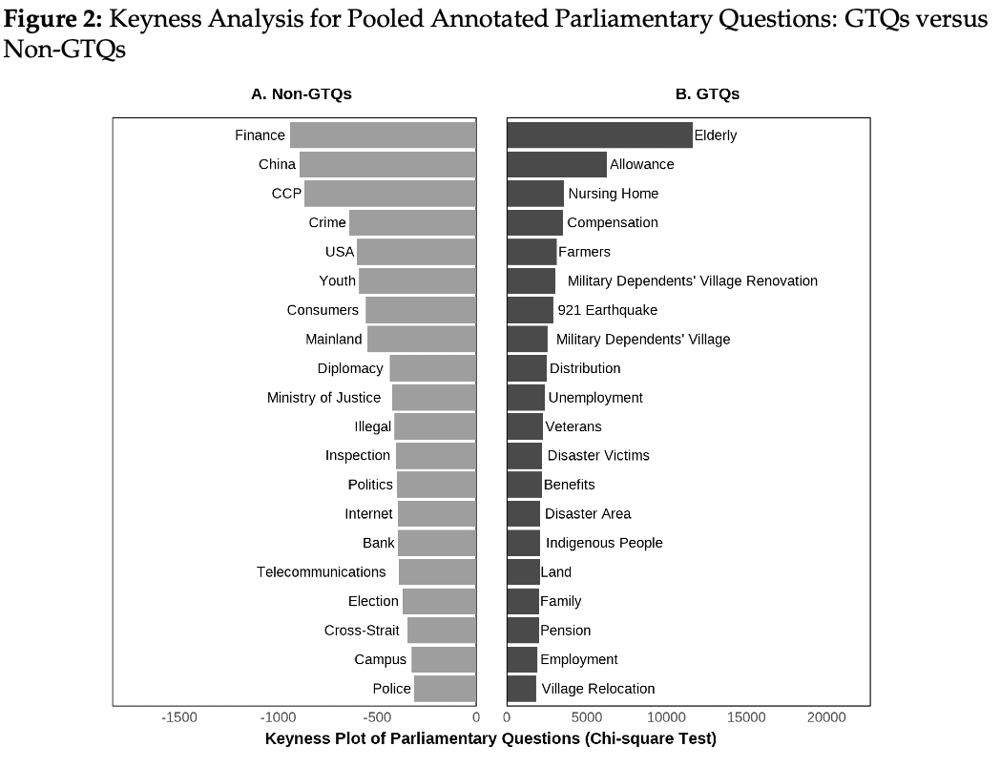

exclude: true

```{r, setup, include = FALSE}
# if (!require("pacman")) install.packages("pacman")
# library(pacman)
# p_load(
#   kableExtra, snakecase, janitor, huxtable, pagedown,                                                  # Formatting
#   ggplot2, ggthemes, ggeffects, ggridges, igraph, network, ggpubr, ggformula, gridExtra, RColorBrewer, # Visualization
#   tidyverse, lubridate, stringr, dplyr, purrr, tibble, tidyr, lubridate, knitr,                        # General tidyverse toolkit
#   readxl,reshape2,
#   parallel, future, furrr, future.apply, doParallel,                                                   # Paralleling
#   devtools, reticulate, usethis                                                                        # programming
# )
library(knitr)
# Define colors
red_pink   = "#e64173"
turquoise  = "#20B2AA"
orange     = "#FFA500"
red        = "#fb6107"
blue       = "#3b3b9a"
green      = "#8bb174"
grey_light = "grey70"
grey_mid   = "grey50"
grey_dark  = "grey20"
purple     = "#6A5ACD"
brown      = "#9b684d"
black      = "#000000"
magenta_red    = "#9b4d80"
magenta_green  = "#4d9b68"
red_green      = "#9b4d59"
blue_green     = "#4d599b"
magenta_yellow = "#9b8f4d"


# Knitr options
opts_chunk$set(
  comment = "#>",
  fig.align = "center",
  fig.height = 7,
  fig.width = 10.5,
  warning = F,
  message = F
)
opts_chunk$set(dev = "svg")
options(
  device = function(file, width, height){
    svg(tempfile(), width = width, height = height)
    })
options(knitr.table.format = "html")

# pagedown::chrome_print("file:///Users/yenchiehliao/Dropbox/pork-barrel-messeges/slides/pork-barrel-messages.html#1", verbose = FALSE)


```


```{python include=FALSE}
# # Built-in Library
# import math
# import re
# import collections
# import zipfile
# import random
# from itertools import chain
# import pandas as pd
# import numpy as np
# 
# # ML & Deep Learning
# from sklearn.model_selection import train_test_split
# import tensorflow as tf
# from tensorflow.keras import layers
# import tensorflow_datasets as tfds
# from tensorflow.keras.callbacks import EarlyStopping,TensorBoard
# from transformers import BertTokenizer
# 
# # NLP toolkit
# import spacy
# 
# # Visualization
# import seaborn as sns
# import matplotlib.pyplot as plt

# Dimensional Deduction
# from sklearn.decomposition import PCA

```


---
layout: true
# .tiny[Overview]
---
name:overview

- .small.hi-grey[Motivation:]  <br> 
  .small[- How does the electoral reform change legislators’ preference and their intentions to bring home the bacon?]  
- .small.hi-grey[Theoretical Expectation:] <br> 
  .small[- Scholars have clearly explained why intraparty competition by different rules of electoral systems increases legislators’ incentives to run on a personal reputation] 
  .small[- We however know little about whether actual impacts introduced by the electoral reform through MMD (Multi-members District) to SMD (Single-member District) reduce legislators’ motives to pursue pork barrel project in the legislature.]
- .small.hi-grey[Data and Method:] <br> 
  .small[- I finetune  state-of-the-art transformer architectures fine-tuned with pork barrel-annotated legislation to evaluate pork-barrel activities in parliamentary questions.]
  .small[- Approximately 150,000 PQs between 1993-2019]  
- .small.hi-grey[Major Finding:] <br> 
  .small[- Evidence exists to show that legislators under MMD are more likely to express political intention about pork-barrel projects in written parliamentary questions.]
  .small[- the reform demonstrates temporal dynamics: while initially reducing legislators’ incentives for geographically targeted benefits, this constraining effect gradually diminishes and even reverses during election years.]

---
layout: true
# .tiny[Legislative Motions]
---
name:why-pq

#### Legislaive activities such as .ul.hi-grey[_legislative votings_], .ul.hi-grey[_debates_] (*e.g, ParSpeech V2*) and .ul.hi-grey[_parliamentary questions_] (*e.g, LACAN*) play a significant role in most democracies. 


> __Roll Calls__: Legislative votings are generally dominent by party 

> + .grey-light.it[Slapin et. al (2018): Politicians grandstand strategically against party in the British Parliament]

> + .grey-light.it[Park (2021): in US House committee Hearings]


> __Debates__: MPs are not equally access to floor speech


#### The advantages of using the PQs: 

> .ul.hi-grey[_comprehensive_], .ul.hi-grey[_accessible_], and .ul.hi-grey[_rich_] 


> The party leadership have less control over MP's motivation to employ parliamentary questions .grey-light.it[(Shane 2011)].

> Parliamentary questions may reveal MPs' interests in policy preference .grey-light[(Shane 2011; Saalfeld 2011)].
 
---

&nbsp;

#### MPs ask questions for several reasons:

> + Because of their .hi-grey[expertise] or domain responsibility of delegation for question topics.


> + Personal preference such as their nature of .hi-grey[substantive representation] .grey-light.it[(Russo 2021; Saalfeld 2011; Martin 2011)]


> + Electoral motivation: .hi-grey[personal reputation] .grey-light[(Martin 2011)]


---
layout: true
# .tiny[Parliarmentary Questions: An Example]
---
name:sampled-pork
 
&nbsp;&nbsp;
 
```{r echo = F, out.width = "80%"}

```

---
layout: true
# .tiny[Background & Literature]
---
name:background

&nbsp;&nbsp;

#### Theoretical Expectation:


<!-- > + This was thought to intensify majority-seeking parties to run more than one candidate in a district, which increases incentives for candidates to run on personal votes against their party reputation .grey-light[(Cox 1990; Carey and Shugart 1995)].  -->

<!-- > + Under SNTV, co-partisan candidates cannot rely exclusively on their party reputation and have to find an alternative means of attracting votes by .hi-grey[running on a personal reputation] via .hi-grey[providing paricularistic services] .grey-light[(Cain, Ferejohn, and Fiorina 1987; Reed 1994; Carey and Shugart 1995)]. -->


> + Main Hypothesis: _Legislators elected under candidate-centered electoral systems (SNTV-MMD) are more likely to submit geographically targeted questions than those elected under party-centered systems (SMD)._


```{r echo = F, out.width = "85%"}

```


---
layout: true
# .tiny[Methodology]
---
name:research-design


#### Model-Finetuning:

> + Used existing labeled pork-barrel legislation as training data

> + Fine-tuned three major transformer models for Chinese classification tasks to identify

> + pork-barrel features in parliamentary questions across time periods

#### Validation with Keyness Analysis:

> + Conducted post-hoc evaluation using QTA techniques

> + Validated results using development set

####  Regression Analysis:

> + Performed regression analyses to test hypotheses

> +  Controlled for legislator and municipality fixed effects across years


---
layout: true
# .tiny[Training Data]
---
name:research-design


#### Pork Barrel Legislation Corpus:

> - Typical pork-barrel policies (or legislation) mainly incur distributed costs while generating parochial benefits for .ul.hi-grey[_specific regions_] or .ul.hi-grey[_designated population groups_].


```{r echo = F, out.width = "55%"}

```


> - This dataset was cross-coded by three social science researchers to perform its validity, which achieves 99% in terms of consistency and preciseness among coders .grey-light[(Luor and Hsieh 2008; Luor and Liao 2009)].

---
layout: true
# .tiny[Model-Tuning Strategies]
---
name:background


#### Train, Test and Dev Set:

```{r echo = F, out.width = "70%"}

```


#### Normalized Tensors: 

```{r echo = F, out.width = "60%"}

```

---

&nbsp;&nbsp;


#### AnnealOnPlateau Technique


```{r echo = F, out.width = "90%"}

```


---


#### Performance Metrics for All Transformer Models

```{r echo = F, out.width = "98%"}

```


---

####  Monitoring Generalization Performance

```{r echo = F, out.width = "85%"}

```


---

#### Following recent application (i.e., Müller and Proksch, 2024; Sebok and Kacsuk, 2021). 


```{r echo = F, out.width = "85%"}

```


---
layout: true
# .tiny[Regression Design]
---
name:research-design


&nbsp;&nbsp;


#### Construction of Pork Barrel Index:

```{r echo = F, out.width = "75%"}

```

&nbsp;

#### Regression Design:

```{r echo = F, out.width = "75%"}

```


---
layout: true
# .tiny[Results]
---
name:results

&nbsp;

```{r echo = F, out.width = "75%"}

```

---

&nbsp;
#### Predicted Values of Pork Barrle Score with 95% Confidence Intervals.


```{r echo = F, out.width = "85%"}

```


---
layout: true
# .tiny[Takeaway]
---

#### Takeaway

- Evidence exists to show that legislators under SNTV are more likely to ask pork-barrel projects in the questions. 

- While initially reducing legislators’ incentives for geographically targeted benefits, this constraining effect gradually
diminishes and even reverses during election years.

#### The Limitation:

>  __Training Data Limitation__: The training data for pork barrel legislation classification used in this paper covers a period of nearly ten years. However, the models might have limitations in capturing new concepts and patterns that emerged in the post-reform period. 


> The steady decrease in the total number of parliamentary questions (PQs) since 2003 might be attributed to the rise of social media as an alternative channel for constituent communication. -> __Social Media?__

---
layout: false
class: inverse, center, middle

# Thank You

---
layout: true
# .tiny[Table of the Appendix]
---
name:appendix

&nbsp;
&nbsp;
&nbsp;

#### Supplementary

.turquoise.smaller[ [The Number of Parliamentary  (Pork) Question](#num-pq) | [The Performance of the Models](#performance) 
]


---
layout: true
# .tiny[The Number of Pork Questions in CAP Domains]
---
name:num-pq
&nbsp;
&nbsp;


```{r echo = F, out.width = "80%"}

```

---
layout: true
# .tiny[The Number of Parliamentary Questions]
---

&nbsp;&nbsp;


```{r echo = F, out.width = "75%"}

```


```{r eval=FALSE, include=FALSE}
pagedown::chrome_print("file:///Users/yenchiehliao/Dropbox/budapest-methods-workshop/electoral-systems-and-legislative-preferences.html#1", verbose = FALSE)
```


